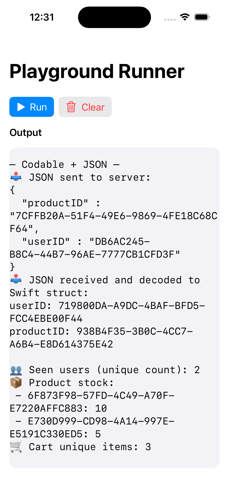

# SwiftTaggedExample
iOS project that presents how to use swift-tagged library. This is the basecode for following post [Goodbye Raw Strings, Hello swift-tagged](https://javios.eu/uncategorized/goodbye-raw-strings-hello-swift-tagged/) 

## Review

## Requirements

- **Xcode 15.0 or later**
- **iOS 16.0 or later**

## 🔖 License

This project is licensed under the MIT License.  
See the [LICENSE](./LICENSE) file for details.

